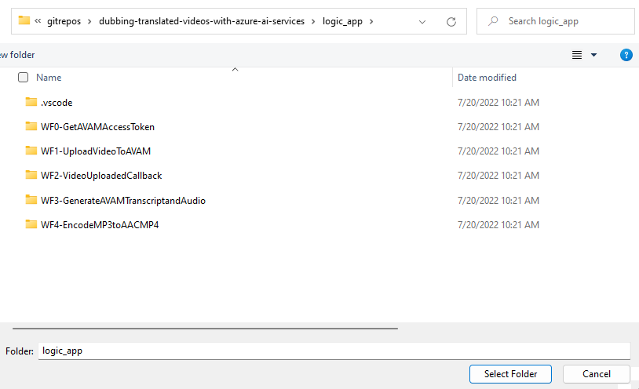

# Using Azure Cognitive and AI Services to Dub Video Translations
This solution allows a user to upload a video to Azure Blob Storage, and then automatically process and dub it into multiple languages, which can be then viewed using the Azure Video Indexer website. 

## What gets deployed? 
The deploy folder contains Azure bicep template code which deploys a number of resources: 

1. A storage account for video uploads and for intermediate assets used in the creation of the new audio tracks. 
1. An Azure App Insight resource and Log Analytics workspace
1. An Azure Logic Apps (standard) account, which includes the following resources
    1. Logic App resource
    2. App service plan
    3. Azure Storage Account (for logs and workflow state tracking)
1. Video Indexer account, which includes:
    1. Video Indexer
    1. Media Services Account
    1. Media Services Storage Account
    1. Streaming endpoint
1. Azure function, which includes
    1. Function app
    1. An app service plan
    1. A storage account (for logs and workflow state tracking)
1. Azure Key vault
1. A Speech Services instance, part of the Azure Cognitive Services family

## Pre-requisites:
* Install the [Azure CLI client](https://docs.microsoft.com/en-us/cli/azure/install-azure-cli) on your machine. 
* [Create an Azure app registration](https://docs.microsoft.com/en-us/azure/active-directory/develop/howto-create-service-principal-portal) (a.k.a. service principal). This will be used to authenticate to various services. 
    * After creating the app registration, make note of the 
        * The client/application ID
        * The directory / tenant ID
        * Go to Certificates & Secrets -> Generate new client secret
* [Install Visual Studio Code]  and add the Logic Apps (Standard) extension 
* Install Azure Storage explorer

## Deployment and Configuration Steps
1. Clone repo.
1. Log in to Azure CLI client ``az login``
1. From the command line, navigate to the deploy folder, i.e. ``cd ./deploy/``
1. Create a new resource group ``az group create -l eastus2 -g RG-VideoDubbing-Bicep``
1. Deploy the bicep templates. Choose your own prefix instead of "tla" and include the app replace the guid with the id of your service principal: ``az deployment group create -g RG-VideoDubbing-Bicep --template-file .\main.bicep --parameters prefix=tla spClientId=0000000-0000-0000-0000-000000000000``
1. In the Azure Portal navigate to the resource group you just created and deployed to. 
1. **Give Service Principal "Contributor" role on Resource Group**
    1. Navigate to your newly-created resource group in the Azure Portal. 
    1. Click on "Access Control (IAM)"
    1. Click the "+ Add" option and choose "Add role assignment"
    1. Choose "Contributor" then click "Next"
    1. Click "Select members" and then search for the app name of your service principal
    1. Click "Review and Assign" and then submit
1. **Create an uploads directory in Azure Storage**
    1. Navigate to your storage account that will be used for video uploads and working files (this will be named something like {your prefix}**videodubstg**{uniquestring})
    1. Open the videodubbing storage container.
    1. Click "Add Directory". Name the directory "uploads" (lower case)
1. **Link Video Indexer and Media Services**
    1. Navigate to your Video Indexer resource. 
    1. You may see a message that says "This account is not connected to the specified Azure Media Service account due to a missing role assignment." If this shows, click the "Assign role" button 
1. **Configure Access Policy for Key Vault** - your Logic App needs to be able to read secrets from the Azure Key Vault, and so will you. 
    1. Copy the name of your deployed logic app. (i.e. "bdl-dubbing-logicapp-r2qqwn6j54t3c")
    1. Navigate to your key vault
    1. Go to Access Policies
    1. +Add access policy
    1. Under "Secret Permissions" select "Get" and "List" options. 
    1. Under Select principal click "None selected" then search for and select the name of your Logic App. 
    1. Click "Add"
    1. Repeat the above steps using **your own User ID as the principal** and assign yourself all rights on the key vaults using the **Key, Secret & Certificate Management** template option. This will give you all permissions. 
    1. **Don't forget to click "SAVE" on before navigating away from the KV access policy  screen!**
1. **Set Logic Apps to access resources**
    Note: ``In this section, be sure to use the exact names for the connections``
    1. Open Logic apps
    2. Click on "Workflows"
    3. Add a Workflow named "ConnectionsSetup". This can be a statful workflow. 
    3. Open your new workflow. Click on "Designer". 
    4. For the first trigger, type in the word Request and set the trigger to "When a HTTP request is received"
    5. Click the + button to add an action to your workflow. Click on the action square.
    5. Add a Key Vault "Get Secret" action.
        * Select the Azure tab in the action pane (not the Built-in)
        * Click "connect with managed identity".
        * In "connection name" put this exact string: ``keyvault``
        * In vault name paste the name of your keyvault (i.e. bdl-keyvault-r2qqwn6j54t). The Managed Idnetity field will say "System-Assigned Managed Identity". 
        * Click "Create" 
        * Select any of the listed secrets 
        * **Click "Save"** to save the workflow. This will preserve the connection which can be used by other workflows in the logic app. 
    6. Add a "List Blobs (V2)" action
        * Create a new action in your workflow after "Get Secret". 
        * Select the Azure tab in the action pane (not the Built-in)
        * Search for "List Blobs" and choose the "List Blobs (v2)" action
        * For connection name enter exactly: ``azureblob``
        * Authentication type: Access Key
        * Azure Storage Account Name: paste the account name for your upload/working storage account (i.e. bdlvideodubstgr2qqwn6j54)
        * In a separate tab, navigate to your storage account > Access Keys > "Show Keys" > then copy the key string. Paste this in the Azure Storage Account Access Key field in Logic Apps.
        * Click Create. 
        * Under storage account name, choose "Use Connection Settings" 
        * Under folder type or navigate to "/videodubbing/uploads/"
        * **Click save**
    7. Add a "Get Accounts" Video Indexer action
        * Add a new action after List Blobs.
        * Select the Azure tab in the action pane (not the Built-in)
        * Search for "Video Indexer get accounts" 
        * Under connection name set the value to exactly: ``videoindexer-2``
        * Under API Key enter any random string (i.e. "123"). We will be using the more modern identity-based authentication instead. 
        * Click "Create"
        * **Click save**
    8. Add Azure Function connections
        * Add a new action after Get Accounts
        * Select Built In tab in the action pane.
        * Search for "Function"
        * Add a "Call an Azure Function" action. 
        * Call this connection ``TranscriptToAudio``
        * Click on your deployed function app (i.e. bdl-dubbing-function-r2qqwn6j54t3c)
        * Select the TranscriptToAudio function (i.e. bdl-dubbing-function-r2qqwn6j54t3c/TranscriptToAudio)
        * Click "Create"
        * Set the Method to POST
        * Type ``'{}'`` in the Request body field.
        * **Click Save**
        
    9. Add additional Function connections
        * Refresh the page and repeat these steps for the "EncodeMP3toAACMP4" and "UpdateVideoManifestXML" functions. 
        * Add a new Call Azure Funciton action. 
        * In the new action block click "Change connection"
        * Click Add New
        * List the connection name as exactly ``EncodeMP3toAACMP4`` 
        * Click the name of your deployed function. 
        * Choose the corresponding function. 
        * Click create
        * Set method to POST
        * Type ``'{}'`` into the body field
        **Click Save**
        * Repeat for the next function ``UpdateVideoManifestXML``
        * ``Note: if your functions don't load in the Logic App screen, you may need to navigate to the Azure Function resource and check in the Deployment Center if the function container finished deploying.``
        * ``Note: if you are unsuccessful at saving the workflow, you may need to delete the Functions actions step. Right-click and delete. Then, try again.``

1. **Deploy your logic apps code from VS Code** 
    1. Open the ./logic_app directory directly in VSCode. (If you try to deploy from the root folder you may get an error)
    
    1. Ctrl+Shift+P to open command pallet
    1. Type "Azure: Sign In" to sign and hit enter to sign in to your Azure account. 
    1. Re-open the command pallet.
    1. Type "Deploy to Logic App" and choose the menu option. 
    1. Follow the prompts to deploy the code to your newly created logic app (i.e. bdl-dubbing-logicapp-r2qqwn6j54t3c)
    1. If prompted to overwrite the existing deployment, click "Deploy" 
    1. After deployment, navigate to your logic app in the Azure Portal. You should see new workflows added. 

1. **Connect your new Logic App workflows with Azure Functions**
    1. Navigate to the "WF3-GenerateAVAMTranscriptandAudio" workflow.
    1. In the designer, locate the "Call AzureFn TranscriptToAudio" step. 
    1. Click on the Function action step.
    1. In the action pane, click change connection.
    1. Select the TranscriptToAudio function connection you created earlier.
    1. **Click Save**
    1. Navigate to WF4-EncodeMP3toAACMP4 workflow and repeat these steps for the remaining two Function actions: "EncodeMP3toAACMP4" and "UpdateVideoManifestXML" function connections. 
    1. **Click save**

1. **Update Function App Settings**
    1. Open your function app in the Portal > Configuration
    1. In the app settings, set the CLIENT_APP_SECRET to the secret for your service principal. 
    1. Be sure to click SAVE before navigating from the app settings screen. 

1. **Update Client App Secret in Key Vault**
    1. Navigate to your Key Vault
    1. Click on "Secrets"
    1. Find the CLIENT-APP-SECRET secret.
    1. Click "New Version"
    1. In the value field paste the client secret for your service principal/app registration. 
    1. Click Create.

1. **Update Logic App Flow endpoint urls in Key Vault** 
    1. In Key Vault, locate the LOGICAPP-ENDPOINT-GET-AVAM-ACCESS-TOKEN secret. 
    1. In a separate browser tab, navigate to your Logic App workflows. 
    1. Click on WF0-GetAVAMAccessToken.
    1. On the overview page, copy the Workflow URL.
    1. In Key Vault, create a new version of the LOGICAPP-ENDPOINT-GET-AVAM-ACCESS-TOKEN secet. 
    1. Paste in the value of the workflow URL. 
    1. Click Create. 
    1. Repeat for the following secrets and workflows
        * LOGICAPP-ENDPOINT-AVAM-UPLOAD-CALLBACK (WF2)
        * LOGICAPP-ENDPOINT-AVAM-GENERATE-CAPTIONS (WF3)
        * LOGICAPP-ENDPOINT-ENCODE-MP3TOAACMP4 (WF4)
        
1. **Update Language Config**
The language config setting is house in the Key Vault under the SPEECH-LANGUAGES-CONFIG
secret. This is a JSON array that specifies what language and what voice should be used to generate the dubbed audio. Update your own list using the supported pre-built neural voices listed here: https://docs.microsoft.com/en-us/azure/cognitive-services/speech-service/language-support?tabs=speechtotext#text-to-speech. You finished product should look should look something like this: 
    ```
    [
    {
        "language-text-code": "zh-Hans",
        "language-three-letter-code": "zho",
        "language-voice-code": "zh-CN",
        "language-voice-name": "zh-CN-YunxiNeural"
    },
    {
        "language-text-code": "es-MX",
        "language-three-letter-code": "spa",
        "language-voice-code": "es-MX",
        "language-voice-name": "es-MX-JorgeNeural"
    },
    {
        "language-text-code": "fr-FR",
        "language-three-letter-code": "fra",
        "language-voice-code": "fr-FR",
        "language-voice-name": "fr-FR-HenriNeural"
    },
    {
        "language-text-code": "th-TH",
        "language-three-letter-code": "tha",
        "language-voice-code": "th-TH",
        "language-voice-name": "th-TH-NiwatNeural"
    }
    ]
    ```
1. **Test the End to End Workflow**
* Upload a video to the "uploads" folder in your blob storage account. 
* Open the "WF1-UploadVideoToAVAM" workflow to begin monitoring progress. 
* If WF1 is successful, you can log in to https://www.videoindexer.ai/ to monitoring the video indexing process. 
* Once video indexing reaches 100%, check WF2 and WF3. 
* You can also monitor the creation of intermediate assets in the "working-files" directory in the video dubbing storage account (the same account where you created the upload folder)
* To monitor the Azure Function as it generates the new language audio, open your azure function > Functions > TranscriptToAudio > Monitor > Logs
* If any particular WF fails, you should should be able to retrigger the run within the workflow run screen in the Logic Apps screen. 